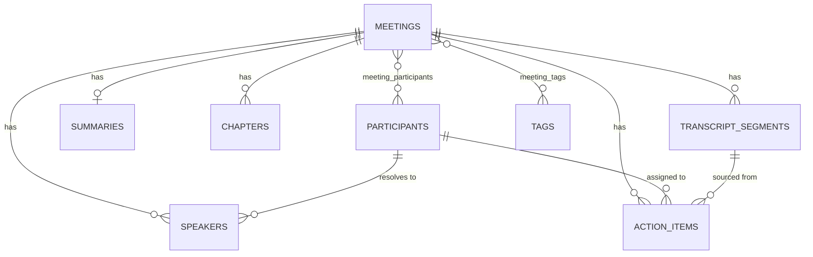

# Meeting Notes & Transcription Platform (Fireflies.ai clone)

A meeting-intelligence web app: browse a library of past meetings, open an interactive
transcript with speaker labels and timestamps, read AI-style summaries, action items and a
time-stamped outline, and search across everything.

Real speech-to-text is deliberately out of scope (per the assignment). Transcripts are
seeded from fixtures or ingested from uploaded files; summaries are seeded or generated
deterministically from transcript text.

> **Build status:** the backend is implemented and verified; the frontend is scaffolded but
> not yet built. See [Implementation status](#implementation-status) for the honest
> breakdown, and [PLAN.md](./PLAN.md) for the phased plan and what comes next.

---

## Tech stack

| Layer | Choice | Notes |
|---|---|---|
| Frontend | Next.js (App Router) + TypeScript + Tailwind | scaffolded |
| Backend | Python 3.12 · FastAPI · SQLAlchemy 2.0 · Pydantic v2 | implemented |
| Database | SQLite (WAL, foreign keys enforced) | implemented |
| Runtime | Docker (`python:3.12-slim`) | implemented |

**Why FastAPI over Django:** the app is a focused REST API over a small schema. FastAPI gives
typed request/response models and generated OpenAPI docs without Django's ORM/admin/templating
surface, which would go unused here.

**Why Docker locally as well as in production:** the development machine runs Python 3.14,
for which several pinned dependencies have no prebuilt wheels. Running the backend in the
same `python:3.12-slim` image everywhere removes an entire class of "works on my machine"
problems and makes the deployment artifact the thing that was actually tested.

---

## Running it

### Backend (Docker — recommended)

```bash
docker build -t fireflies-backend:dev ./backend
docker run --rm -p 8000:8000 -v "$PWD/backend/data:/srv/data" fireflies-backend:dev
```

- API: <http://localhost:8000/api/health>
- Interactive docs: <http://localhost:8000/docs>

The database is created and seeded automatically on first start. The bind-mount keeps the
SQLite file on the host so data survives container rebuilds.

### Backend (without Docker)

Requires Python 3.11 or 3.12 (**not 3.14** — see above):

```bash
cd backend
python -m venv .venv && .venv/bin/pip install -r requirements.txt
.venv/bin/uvicorn app.main:app --reload
```

### Frontend

```bash
cd frontend
npm install
npm run dev          # http://localhost:3000
```

### Verification scripts

```bash
# Schema, PRAGMAs, seeding, loader idempotency, cascade deletes
docker run --rm -e DATABASE_URL=sqlite:////tmp/v.db \
  -v "$PWD/backend/scripts:/srv/scripts:ro" \
  fireflies-backend:dev python scripts/verify_schema.py

# Every seed fixture against the loader's invariants + cross-fixture consistency
docker run --rm -v "$PWD/backend/scripts:/srv/scripts:ro" \
  -v "$PWD/backend/app/seed/data:/srv/app/seed/data:ro" \
  fireflies-backend:dev python scripts/validate_fixtures.py
```

---

## Architecture

```
frontend/                    Next.js App Router client
backend/
  app/
    core/        config (pydantic-settings), engine/session, SQLite PRAGMAs
    models/      SQLAlchemy ORM, one module per domain group
    schemas/     Pydantic request/response models — deliberately separate from the ORM
    services/    query and business logic; routers stay thin
    routers/     HTTP layer only: validation, status codes, dependency injection
    seed/        fixtures (JSON) + idempotent loader with timeline validation
  scripts/       standalone verification scripts
```

Requests flow **router → service → model**. Routers never build queries and services never
know about HTTP, so query behaviour is testable without a client and the HTTP layer stays
readable.

**Schemas are separate from ORM models** rather than serialising the ORM directly. This lets
the list endpoint return a lightweight row (no transcript) while the detail endpoint returns
the full notebook payload, and stops internal columns leaking into the API by default.

---

## Database schema



| Table | Purpose |
|---|---|
| `meetings` | title, description, `meeting_date`, `duration_ms`, `audio_url`, source, status, organizer |
| `participants` | people across all meetings; one row is flagged `is_current_user` |
| `meeting_participants` | M2M join, carries `role` (host/attendee) |
| `speakers` | per-meeting diarization label, optionally resolved to a `participant` |
| `transcript_segments` | one spoken line: `seq`, `start_ms`, `end_ms`, `text` |
| `summaries` | overview + JSON `keywords` and `bullet_notes` |
| `chapters` | time-stamped outline entries; clicking one seeks the player |
| `action_items` | text, assignee, `is_done`, due date, optional source segment |
| `tags` / `meeting_tags` | topic tagging and filtering |

### Three design decisions worth explaining

1. **All time is stored as integer milliseconds** (`start_ms`, `end_ms`, `duration_ms`).
   Transcript segments, chapters and meeting duration therefore share one unit, so
   click-a-line-to-seek, chapter jumps and progress-bar maths are the same lookup rather than
   three separate conversions with three separate rounding bugs. Indexed on
   `(meeting_id, start_ms)`, which is exactly the query the player makes on every tick.

2. **`speakers` is separate from `participants`.** A transcript can carry unresolved speaker
   labels (`"Speaker 1"`) that are later mapped onto a real person — which is precisely what
   an uploaded `.vtt` file gives you. Collapsing the two would make ingestion lossy.

3. **JSON columns only for opaque display lists.** `keywords` and `bullet_notes` are always
   read as a whole and never queried, so they live in JSON. Anything filtered, sorted or
   seeked to — chapters, action items — is a real table with real foreign keys. This is a
   deliberate line, not convenience.

SQLite specifics: `PRAGMA foreign_keys=ON` is set on every connection (SQLite ignores foreign
keys by default, which would silently defeat the cascade design) and `journal_mode=WAL` for
concurrent reads during playback.

---

## API

Base path `/api`. Full interactive reference at `/docs` when running.

| Method | Path | Description | Status |
|---|---|---|---|
| GET | `/api/health` | Liveness probe | ✅ |
| GET | `/api/meetings` | List: `search`, `participant_id`, `tag`, `date_from`, `date_to`, `sort`, `limit`, `offset` | ✅ |
| GET | `/api/meetings/{id}` | Full notebook payload (summary, chapters, action items, speakers) | ✅ |
| GET | `/api/meetings/{id}/transcript` | Segments + speakers + duration | ✅ |
| GET | `/api/participants` | All participants (powers the filter) | ✅ |
| GET | `/api/tags` | All tags | ✅ |
| GET | `/api/me` | The mocked logged-in user | ✅ |
| POST | `/api/meetings` | Create by form or pasted transcript | ⬜ |
| PATCH | `/api/meetings/{id}` | Edit metadata | ⬜ |
| DELETE | `/api/meetings/{id}` | Delete (cascades) | ⬜ |
| POST | `/api/meetings/upload` | Ingest `.txt` / `.vtt` / `.json` | ⬜ |
| POST/PATCH/DELETE | `/api/.../action-items` | Action item CRUD | ⬜ |
| GET | `/api/search` | Global cross-meeting transcript search | ⬜ |

`search` matches on meeting title, description **and participant name** — "find the call with
Priya" is as common a query as searching by title.

The list endpoint omits transcript segments by design: a 10-row library would otherwise ship
thousands of lines that no row renders. Action-item counts on the list are computed with one
aggregate query per page rather than per-row lookups, avoiding an N+1.

---

## Seed data

Five meetings, 174 transcript segments, 10 participants, 22 chapters and 22 action items load
automatically on first boot: a roadmap review, an enterprise sales discovery call, an
engineering standup, a manager 1:1, and a customer onboarding interview.

Fixture dates are stored as `days_ago` offsets and resolved at load time, so the library
always looks current no matter when the repo is cloned.

The fixture format is documented in
[`backend/app/seed/data/FORMAT.md`](./backend/app/seed/data/FORMAT.md) and is the same shape
the upload endpoint accepts, so seeding and ingestion share one parser and one set of rules.

**Fixtures are validated, not trusted.** `validate_fixture()` runs at load time and fails
startup if a fixture's timeline is inconsistent — most importantly if `duration_ms` does not
cover the last segment, which would silently produce a seek bar with dead space or
unreachable lines. `scripts/validate_fixtures.py` additionally checks consistency *across*
fixtures: because participants are deduplicated on email, the same address appearing with two
different names or avatar colours would produce one participant whose identity depends on
load order.

---

## Implementation status

**Done and verified by execution**
- Database schema, cascades, PRAGMAs (9/9 checks pass)
- Idempotent seed loader with timeline validation
- 5 of 6 seed fixtures, all validated
- Read API: list/detail/transcript/participants/tags/me/health, live-tested
- Backend Dockerfile

**Not yet implemented**
- Meeting and action-item CRUD; transcript upload and parsing
- The entire frontend beyond the scaffold — library view, notebook, player sync,
  summary panel, modals, toasts, placeholders
- Global search, export, dark mode and the other bonus items
- Deployment (target: single EC2 + nginx + CloudFront, see PLAN.md Phase 11)

---

## Assumptions

- **No authentication.** One seeded participant (`alex.rivera@northwind.io`) is flagged
  `is_current_user` and treated as logged in, per the assignment's allowance.
- **No real transcription.** Audio is a placeholder; the player is driven by a virtual clock
  over segment timestamps, which the assignment explicitly permits. A real `<audio>` element
  is used when a meeting has an `audio_url`.
- **Summaries are seeded**, with a deterministic generator planned for uploaded transcripts.
- **`create_all` instead of migrations.** With SQLite and a single-instance deployment there
  is no migration story worth maintaining; the schema is versioned with the code.
- **Participants are identified by email**, so the same person across meetings is one row.
  This is what makes participant filtering meaningful.

---

## Project documentation

- [PLAN.md](./PLAN.md) — phased implementation plan, exit criteria, current state, next steps
- [WORKLOG.md](./WORKLOG.md) — chronological record of decisions, bugs found, and corrections
- [backend/app/seed/data/FORMAT.md](./backend/app/seed/data/FORMAT.md) — fixture/upload format
