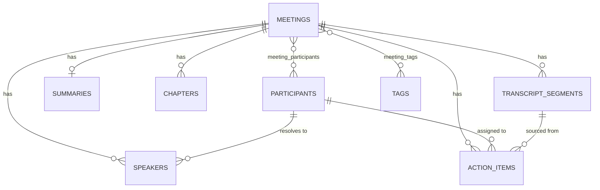

# Meeting Notes & Transcription Platform (Fireflies.ai clone)

A meeting-intelligence web app: browse a library of past meetings, open an interactive
transcript with speaker labels and timestamps, read AI-style summaries, action items and a
time-stamped outline, and search across everything.

Real speech-to-text is deliberately out of scope (per the assignment). Transcripts are
seeded from fixtures or ingested from uploaded files; summaries are seeded or generated
deterministically from transcript text.

> **Build status:** the backend is complete and verified by execution (~40 automated
> assertions). The frontend is built: library, notebook, player sync, transcript search,
> summary/action-item CRUD, filters, global search and cross-meeting Q&A with citations.
> Not deployed yet. See [Implementation status](#implementation-status) for the honest
> breakdown.

---

## Tech stack

| Layer | Choice | Notes |
|---|---|---|
| Frontend | Next.js 16 (App Router) + TypeScript + Tailwind | implemented |
| Backend | Python 3.12 · FastAPI · SQLAlchemy 2.0 · Pydantic v2 | implemented |
| Database | SQLite (WAL, foreign keys enforced) | implemented |
| Runtime | Docker (`python:3.12-slim`) | implemented |

**Why FastAPI over Django:** the app is a focused REST API over a small schema. FastAPI gives
typed request/response models and generated OpenAPI docs without Django's ORM/admin/templating
surface, which would go unused here.

**Why Docker locally as well as in production:** the development machine runs Python 3.14,
for which several pinned dependencies have no prebuilt wheels. Running the backend in the
same `python:3.12-slim` image everywhere removes an entire class of "works on my machine"
problems and makes the deployment artifact the thing that was actually tested.

---

## Running it

### Backend (Docker — recommended)

```bash
docker build -t fireflies-backend:dev ./backend
docker run --rm -p 8000:8000 -v "$PWD/backend/data:/srv/data" fireflies-backend:dev
```

- API: <http://localhost:8000/api/health>
- Interactive docs: <http://localhost:8000/docs>

The database is created and seeded automatically on first start. The bind-mount keeps the
SQLite file on the host so data survives container rebuilds.

### Backend (without Docker)

Requires Python 3.11 or 3.12 (**not 3.14** — see above):

```bash
cd backend
python -m venv .venv && .venv/bin/pip install -r requirements.txt
.venv/bin/uvicorn app.main:app --reload
```

### Frontend

```bash
cd frontend
npm install
npm run dev -- -p 3002      # http://localhost:3002
```

The frontend expects the backend at `http://localhost:8000/api`; override with
`NEXT_PUBLIC_API_BASE` in `frontend/.env.local`. Start the backend first — the library
loads its rows from `/api/meetings` on mount.

### Everything at once (Docker Compose)

```bash
cp backend/.env.example backend/.env    # add LLM_API_KEY if you want AI answers
docker compose up -d --build
```

Then open <http://localhost>. That is the whole stack — nginx on port 80 in front of the
Next.js server and the API.

| URL | |
|---|---|
| `http://localhost/` | the app |
| `http://localhost/api/health` | API liveness |
| `http://localhost/docs` | interactive API reference |

---

## Deployment

One host, one published port, one origin. `docker compose up -d --build` is the entire
deployment; on an EC2 box with an Elastic IP attached, nginx answers on port 80 and nothing
else is exposed.

```
          :80
  browser ────▶ nginx ─┬─ /            ──▶ frontend:3000   (Next.js standalone)
                       ├─ /api/        ──▶ backend:8000    (FastAPI/uvicorn)
                       └─ /docs,/redoc ──▶ backend:8000
                                              │
                                              └─ dbdata volume ──▶ /srv/data/app.db
```

**There is no database container.** SQLite is a file, not a server, so the database is the
named volume `dbdata` mounted at `/srv/data` — which is where the backend's default
`DATABASE_URL` already points. `docker compose down` keeps it; `docker compose down -v`
destroys it.

**Why there is no CORS configuration.** The browser only ever talks to one origin. The
frontend is built with `NEXT_PUBLIC_API_BASE=/api`, a relative path, so API calls go back to
whatever host served the page and nginx routes them internally. `CORS_ORIGINS` is therefore
`[]` in production. During local development the two servers *are* separate origins
(`:3002` and `:8000`), which is the only reason the setting exists.

**`NEXT_PUBLIC_API_BASE` is a build argument, not a runtime variable.** `next build` inlines
`NEXT_PUBLIC_*` into the browser bundle, so setting it in compose's `environment:` would have
no effect — the shipped JavaScript would still point at `localhost:8000`. It is passed via
`build.args` instead, and changing it requires a rebuild rather than a restart.

**The LLM is optional and fails quietly.** With no `LLM_API_KEY`, `POST /api/query` still
answers using keyword retrieval and reports `answered_by: "keyword"` — no error, no warning.
If AI answers look shallow in a deployment, check that `backend/.env` exists on the host.
That file is gitignored and is never baked into an image.

### Verification scripts

```bash
# Schema, PRAGMAs, seeding, loader idempotency, cascade deletes
docker run --rm -e DATABASE_URL=sqlite:////tmp/v.db \
  -v "$PWD/backend/scripts:/srv/scripts:ro" \
  fireflies-backend:dev python scripts/verify_schema.py

# Every seed fixture against the loader's invariants + cross-fixture consistency
docker run --rm -v "$PWD/backend/scripts:/srv/scripts:ro" \
  -v "$PWD/backend/app/seed/data:/srv/app/seed/data:ro" \
  fireflies-backend:dev python scripts/validate_fixtures.py

# Every write endpoint against a live server: upload, create, patch, delete,
# action items, cascade behaviour and error codes (29 assertions)
docker run -d --name ff-verify -p 8199:8000 \
  -e DATABASE_URL=sqlite:////tmp/verify.db fireflies-backend:dev
backend/scripts/verify_api.sh http://localhost:8199
docker rm -f ff-verify
```

---

## Architecture

```
frontend/
  src/
    app/         App Router routes: / · /notebook · /notebook/[id] · /askfred · /upload
                 · /settings · /team
    components/
      library/   meeting rows, date grouping, filters, create/edit/upload modals
      notepad/   transcript panel, player bar, summary document, action items
      shell/     sidebar, top bar, placeholder pages
      ui/        primitives: Button, Input, Modal, Toast, SearchModal, Avatar
    lib/         api client, types, sentence splitting, media-clock sync, time formatting
backend/
  app/
    core/        config (pydantic-settings), engine/session, SQLite PRAGMAs
    models/      SQLAlchemy ORM, one module per domain group
    schemas/     Pydantic request/response models — deliberately separate from the ORM
    services/    query and business logic; routers stay thin
    routers/     HTTP layer only: validation, status codes, dependency injection
    seed/        fixtures (JSON) + idempotent loader with timeline validation
  scripts/       standalone verification scripts
```

Requests flow **router → service → model**. Routers never build queries and services never
know about HTTP, so query behaviour is testable without a client and the HTTP layer stays
readable.

**Schemas are separate from ORM models** rather than serialising the ORM directly. This lets
the list endpoint return a lightweight row (no transcript) while the detail endpoint returns
the full notebook payload, and stops internal columns leaking into the API by default.

---

## Database schema



| Table | Purpose |
|---|---|
| `meetings` | title, description, `meeting_date`, `duration_ms`, `audio_url`, source, status, organizer |
| `participants` | people across all meetings; one row is flagged `is_current_user` |
| `meeting_participants` | M2M join, carries `role` (host/attendee) |
| `speakers` | per-meeting diarization label, optionally resolved to a `participant` |
| `transcript_segments` | one spoken line: `seq`, `start_ms`, `end_ms`, `text` |
| `summaries` | overview + JSON `keywords` and `bullet_notes` |
| `chapters` | time-stamped outline entries; clicking one seeks the player |
| `action_items` | text, assignee, `is_done`, due date, optional source segment |
| `tags` / `meeting_tags` | topic tagging and filtering |

### Three design decisions worth explaining

1. **All time is stored as integer milliseconds** (`start_ms`, `end_ms`, `duration_ms`).
   Transcript segments, chapters and meeting duration therefore share one unit, so
   click-a-line-to-seek, chapter jumps and progress-bar maths are the same lookup rather than
   three separate conversions with three separate rounding bugs. Indexed on
   `(meeting_id, start_ms)`, which is exactly the query the player makes on every tick.

2. **`speakers` is separate from `participants`.** A transcript can carry unresolved speaker
   labels (`"Speaker 1"`) that are later mapped onto a real person — which is precisely what
   an uploaded `.vtt` file gives you. Collapsing the two would make ingestion lossy.

3. **JSON columns only for opaque display lists.** `keywords` and `bullet_notes` are always
   read as a whole and never queried, so they live in JSON. Anything filtered, sorted or
   seeked to — chapters, action items — is a real table with real foreign keys. This is a
   deliberate line, not convenience.

SQLite specifics: `PRAGMA foreign_keys=ON` is set on every connection (SQLite ignores foreign
keys by default, which would silently defeat the cascade design) and `journal_mode=WAL` for
concurrent reads during playback.

---

## API

Base path `/api`. Full interactive reference at `/docs` when running.

| Method | Path | Description | Status |
|---|---|---|---|
| GET | `/api/health` | Liveness probe | ✅ |
| GET | `/api/meetings` | List: `search`, `participant_id`, `tag`, `date_from`, `date_to`, `sort`, `limit`, `offset` | ✅ |
| GET | `/api/meetings/{id}` | Full notebook payload (summary, chapters, action items, speakers) | ✅ |
| GET | `/api/meetings/{id}/transcript` | Segments + speakers + duration | ✅ |
| GET | `/api/participants` | All participants (powers the filter) | ✅ |
| GET | `/api/tags` | All tags | ✅ |
| GET | `/api/me` | The mocked logged-in user | ✅ |
| POST | `/api/meetings` | Create by form or pasted transcript | ✅ |
| POST | `/api/meetings/upload` | Ingest `.vtt` / `.json` / `.txt` (5MB, UTF-8) | ✅ |
| PATCH | `/api/meetings/{id}` | Edit metadata | ✅ |
| DELETE | `/api/meetings/{id}` | Delete (cascades) | ✅ |
| POST | `/api/meetings/{id}/action-items` | Add an action item | ✅ |
| PATCH | `/api/action-items/{id}` | Edit / assign / toggle complete | ✅ |
| DELETE | `/api/action-items/{id}` | Remove an action item | ✅ |
| POST | `/api/query` | Ask a question across meetings; returns an answer with citations | ✅ |

`search` (on `/api/meetings`) matches meeting title, description **and participant name** —
"find the call with Priya" is as common a query as searching by title. It powers the Ctrl+K
modal.

`/api/query` answers in natural language over transcript text and returns citations carrying
`meeting_id`, `start_ms`, `speaker_label` and the quoted line. The frontend turns each into a
`/notebook/{id}?t=<ms>` link, so a citation opens the meeting already seeked to that line.
It uses Groq (`llama-3.3-70b-versatile`) when a key is configured and falls back to keyword
retrieval otherwise; the response says which via `answered_by`.

The list endpoint omits transcript segments by design: a 10-row library would otherwise ship
thousands of lines that no row renders. Action-item counts on the list are computed with one
aggregate query per page rather than per-row lookups, avoiding an N+1.

---

## Transcript ingestion and summaries

`.vtt`, `.json` and `.txt` all normalise to one `ParsedTranscript` in
`services/transcript_parser.py`, so persistence, the summary generator and the player are
written once against one shape rather than three times against three. The parser also repairs
what real files actually contain: VTT cues routinely overlap by a few milliseconds at speaker
changes, and pasted text has no timings at all — those lines are timed from their word count
at ~2.75 words/second, which is what makes a pasted transcript playable instead of a wall of
text.

**Uploaded speakers stay unresolved.** A `.vtt` carrying `<v Speaker 1>` produces a `Speaker`
row with `participant_id = NULL`, not a fabricated person. Inventing a participant named
"Speaker 1" would pollute `/api/participants` and corrupt the library's participant filter.
A label that *does* match a known participant is linked automatically. This is the
`speakers`/`participants` split doing real work rather than being decorative.

Because of that, fixture validation is split in two: `validate_timeline()` (ordering,
non-overlap, duration ≥ last segment end) applies to any transcript; the identity checks
(speaker must be a known participant, organizer must match) apply only to seed fixtures,
where a stray name is an authoring typo worth failing startup over.

**Summaries are a deterministic mock**, which the assignment permits. `summarizer.generate()`
is the single entry point and the single swap point — moving to a real LLM means
reimplementing that one function to return the same `GeneratedSummary`, with no caller
changes. Generated rows are stamped `generated_by = "mock"` so the distinction is visible in
the data, not just in the code.

The mock is *extractive*, not templated: it scores real sentences by keyword density and
quotes them. A templated summary would read identically for every meeting and demo as
obvious filler; scoring costs the same and means every keyword, bullet, chapter and action
item traces back to a line an evaluator can find by searching the transcript. Action items
come from commitment cues ("I'll take…", "can you send…", "by Friday") and land as
*editable* rows — cue matching is a heuristic, not comprehension, and the UI should treat it
that way.

---

## Seed data

Five meetings, 174 transcript segments, 10 participants, 22 chapters and 22 action items load
automatically on first boot: a roadmap review, an enterprise sales discovery call, an
engineering standup, a manager 1:1, and a customer onboarding interview.

Fixture dates are stored as `days_ago` offsets and resolved at load time, so the library
always looks current no matter when the repo is cloned.

The fixture format is documented in
[`backend/app/seed/data/FORMAT.md`](./backend/app/seed/data/FORMAT.md) and is the same shape
the upload endpoint accepts, so seeding and ingestion share one parser and one set of rules.

**Fixtures are validated, not trusted.** `validate_fixture()` runs at load time and fails
startup if a fixture's timeline is inconsistent — most importantly if `duration_ms` does not
cover the last segment, which would silently produce a seek bar with dead space or
unreachable lines. `scripts/validate_fixtures.py` additionally checks consistency *across*
fixtures: because participants are deduplicated on email, the same address appearing with two
different names or avatar colours would produce one participant whose identity depends on
load order.

---

## Implementation status

**Done and verified by execution**
- Database schema, cascades, PRAGMAs — 9/9 checks (`verify_schema.py`)
- Idempotent seed loader with timeline validation; 5 seeded meetings, all validated
- Read API: list / detail / transcript / participants / tags / me / health
- Write API: create, upload, patch, delete, action-item CRUD — 29/29 checks (`verify_api.sh`)
- Transcript ingestion for `.vtt`, `.json` and `.txt`, plus pasted text
- Mock summary generation: overview, keywords, bullet sections, chapters, action items
- Backend Dockerfile

**Frontend — built, verified by build + manual use**
- Library: date-grouped rows, participant/tag/date filters, sort, pagination, empty states
- Notebook: interactive transcript with speaker labels, click-a-line-to-seek, active-line
  highlight that follows the clock, auto-scroll with manual-scroll suspension
- **Search within a transcript** with highlighted matches, match counter and Enter /
  Shift+Enter stepping that seeks the player to each hit
- Player bar: play/pause, scrub, rate, chapter jumps
- Summary document, chapters, and full action-item CRUD with optimistic updates and rollback
- Create meeting (form or pasted transcript), upload `.vtt`/`.json`/`.txt`, edit, delete
- Global search modal (Ctrl/Cmd+K) across titles, descriptions and participants
- Cross-meeting Q&A (`/askfred` and the library assistant) with citations that deep-link to
  `?t=<ms>` and land on the cited line

**Not implemented**
- Export (PDF / Markdown / TXT), dark mode, comments and soundbites — bonus items

---

## Assumptions

- **No authentication.** One seeded participant (`alex.rivera@northwind.io`) is flagged
  `is_current_user` and treated as logged in, per the assignment's allowance.
- **No real transcription.** Audio is a placeholder; the player is driven by a virtual clock
  over segment timestamps, which the assignment explicitly permits. A real `<audio>` element
  is used when a meeting has an `audio_url`.
- **Summaries are seeded**, with a deterministic generator planned for uploaded transcripts.
- **`create_all` instead of migrations.** With SQLite and a single-instance deployment there
  is no migration story worth maintaining; the schema is versioned with the code.
- **Participants are identified by email**, so the same person across meetings is one row.
  This is what makes participant filtering meaningful.

---

## Project documentation

- [backend/app/seed/data/FORMAT.md](./backend/app/seed/data/FORMAT.md) — fixture/upload format
